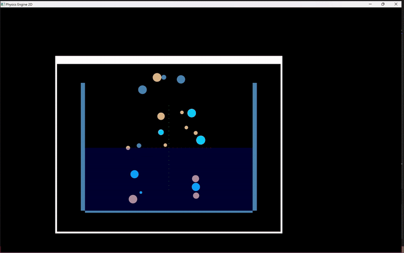
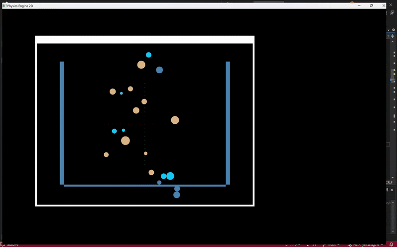

# Physics Engine 2D

This project is a simple 2D physics engine implemented in C++. It uses OpenGL for rendering and GLFW for window and input management. The engine simulates basic physics interactions, including collisions and fluid dynamics.

## Features

- **Circle and Polygon Bodies**: Create and simulate circle and polygonal bodies.
- **Fluid Dynamics**: Simulate interactions with a body of water.
- **Collision Detection**: Efficient collision detection and response.
- **Rendering**: Render the bodies and fluids using OpenGL.
- **Camera Control**: Simple camera control with mouse and keyboard input.

## Examples




## Prerequisites

- **C++ Compiler**: GCC, Clang, or MSVC.
- **OpenGL**: Graphics library for rendering.
- **GLFW**: Library for window and input management.
- **GLEW**: OpenGL Extension Wrangler Library.

## Installation

1. **Clone the repository**:
   ```bash
   git clone https://github.com/Garshers/CarRentalWebsite.git
   cd CarRentalWebsite
   ```

2. **Install dependencies**:

Ensure you have OpenGL, GLFW, and GLEW installed on your system.

3. **Build the project**:
    ```bash
   g++ -o physics_engine main.cpp -lGL -lGLU -lglfw -lGLEW
   ```

## Usage

1. **Run the executable**:
    ```bash
   ./physics_engine
   ```

## Control the simulation:

- **Mouse**: Drag to move the camera.
- **Scroll**: Zoom in and out.
- **Arrow Keys**: Move selected bodies (if implemented).

## Multithreading
A dedicated thread handles intersection calculations for collision detection, ensuring smooth rendering and responsiveness.

# Code Overview

## Main Classes

### `World.h`
- **Gravity Simulation**: Implements gravity effects using a customizable `FlatVector` gravity field.
- **Dynamic Interaction System**: Automatically resolves collisions and fluid interactions in a multithreaded environment.
- **Flexible Object Management**:
  - Supports adding and retrieving bodies and liquids to/from the simulation.
  - Handles various shapes such as circles and polygons.
- **Collision Detection and Resolution**:
  - Supports collision handling between polygons and circles.
  - Detects and resolves inter-body collisions with depth adjustment and impulse application.
- **Liquid Interaction**:
  - Calculates buoyancy forces and fluid resistance for bodies in liquids.
  - Handles air resistance for bodies not submerged in liquids.
- **Threaded Physics Updates**:
  - Dedicated intersection thread for real-time collision handling and fluid dynamics.
  - Adjustable update rates to balance performance and accuracy.
- **Submersion Detection**:
  - Computes the submerged volume of circular bodies for realistic fluid dynamics.
- **Synchronization**:
  - Thread-safe operations using mutexes for managing shared data access.

### `Intersections.h`
- **Circle Intersection:**
  - Checks if two circles intersect.
  - Computes the depth of intersection and the normal vector.
- **Polygon Intersection:**
  - Detects intersection between two polygons using the Separating Axis Theorem (SAT).
  - Calculates the depth of intersection and the normal vector.
- **Circle-Polygon Intersection:**
  - Determines if a circle intersects with a polygon.
  - Computes the depth of intersection and the normal vector.
- **Liquid Circle Intersection:**
  - Checks if a circle intersects with a rectangular liquid boundary (min-max area).
- **Contact Points Detection:**
  - Finds the contact points between two bodies (circle or polygon).
  - Determines the number of contact points and their positions.
- **Helper Methods:**
  - Projection functions to project vertices and circles along an axis.
  - Distance and normal calculation between points and edges.

## Support Classes

### `Bodies.h`
- **Shape Support**: Circle and polygon objects with customizable properties.
- **Dynamic and Static Bodies**: Support for moving and fixed objects.
- **Material Integration**: Physical properties (density, restitution) based on the `Materials` class.
- **Physics Simulation**: Tracks velocity, force, and rotation with the `Step` method.

### `Vector.h`
- **Vector Operations**: Supports basic and advanced operations such as addition, subtraction, multiplication, and division, along with dot product calculations.
- **Length & Distance**: Compute vector length, squared length, and distance between points.
- **Normalization & Scaling**: Includes static methods to normalize vectors and handle scaling.
- **Equality & Comparison**: Provides methods for approximate equality (`NearlyEqual`) and custom operator overloads for intuitive operations.
- **Streaming Support**: Formats vector output for debugging or logging.

### `Materials.h`
- **Predefined Materials**: Includes materials like Birch, Steel, Oak, Glass, and Aluminum, each with unique properties (density, color).
- **Material Typing & Factory Methods**: Enum-based material types and static methods (e.g., `CreateBirch`, `CreateSteel`) for easy instantiation.

### `Liquids.h`
- **Liquid Properties**: Defines liquid behavior with parameters like density, viscosity, and surface tension.
- **Boundary & Interaction**: Supports custom liquid boundaries and automatic boundary analysis for simulations like buoyancy.
- **Predefined Liquids & Factory**: Provides a predefined `Water` liquid and a `CreateBodyOfWater` method for user-defined water bodies.

## Contributing
Contributions are welcome! Please fork the repository and submit a pull request with your changes.

## License
This project is licensed under the MIT License.

"# Physics-Engine-2D" 
